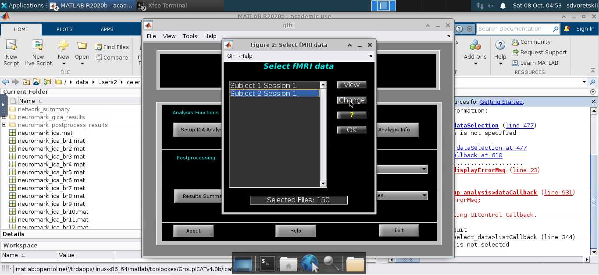

  
 Demote headings (H1 → H2, etc.)
 Use HTML headings/IDs
 Wrap HTML
 Render HTML tags
 Suppress info comment
 Use reckless mode (no alerts)
Help, Docs, Bugs
<!-- Output copied to clipboard! -->

<!-----

You have some errors, warnings, or alerts. If you are using reckless mode, turn it off to see inline alerts.
* ERRORs: 0
* WARNINGs: 0
* ALERTS: 19

Conversion time: 6.033 seconds.


Using this Markdown file:

1. Paste this output into your source file.
2. See the notes and action items below regarding this conversion run.
3. Check the rendered output (headings, lists, code blocks, tables) for proper
   formatting and use a linkchecker before you publish this page.

Conversion notes:

* Docs to Markdown version 1.0β33
* Thu Oct 13 2022 06:11:53 GMT-0700 (PDT)
* Source doc: GiftExampleData
* Tables are currently converted to HTML tables.
* This document has images: check for >>>>>  gd2md-html alert:  inline image link in generated source and store images to your server. NOTE: Images in exported zip file from Google Docs may not appear in  the same order as they do in your doc. Please check the images!


WARNING:
You have 6 H1 headings. You may want to use the "H1 -> H2" option to demote all headings by one level.

----->


<p style="color: red; font-weight: bold">>>>>>  gd2md-html alert:  ERRORs: 0; WARNINGs: 1; ALERTS: 19.</p>
<ul style="color: red; font-weight: bold"><li>See top comment block for details on ERRORs and WARNINGs. <li>In the converted Markdown or HTML, search for inline alerts that start with >>>>>  gd2md-html alert:  for specific instances that need correction.</ul>

<p style="color: red; font-weight: bold">Links to alert messages:</p><a href="#gdcalert1">alert1</a>
<a href="#gdcalert2">alert2</a>
<a href="#gdcalert3">alert3</a>
<a href="#gdcalert4">alert4</a>
<a href="#gdcalert5">alert5</a>
<a href="#gdcalert6">alert6</a>
<a href="#gdcalert7">alert7</a>
<a href="#gdcalert8">alert8</a>
<a href="#gdcalert9">alert9</a>
<a href="#gdcalert10">alert10</a>
<a href="#gdcalert11">alert11</a>
<a href="#gdcalert12">alert12</a>
<a href="#gdcalert13">alert13</a>
<a href="#gdcalert14">alert14</a>
<a href="#gdcalert15">alert15</a>
<a href="#gdcalert16">alert16</a>
<a href="#gdcalert17">alert17</a>
<a href="#gdcalert18">alert18</a>
<a href="#gdcalert19">alert19</a>

<p style="color: red; font-weight: bold">>>>>> PLEASE check and correct alert issues and delete this message and the inline alerts.<hr></p>


**GIFT fMRI Example Data (Resting State)**

How To: A) Insert items under body section, B) Select body headers and hit CTRL+ALT+2, C) Refresh TOC

Table of Contents


[TOC]


# **Introduction** {#introduction}


## Demonstration data for GIFT {#demonstration-data-for-gift}

GIFT is a handy and efficient tool that performs customizable group independent component analysis (GICA) on a study cohort. In this tutorial, we walk you through a typical GIFT analysis explaining the pipeline and its parts. We demonstrate how to use the pipeline on a cohort of 10 males and 10 females from an undisclosed study.


## Different Aspects In Data Processing {#different-aspects-in-data-processing}

This pipeline processes raw data to the end product, including preprocessing using fmriprep. GICA postprocessing is performed afterwards. This group ICA is guided by Neuromark, a brain atlas derived from a big cohort of fMRI scans, as described in [Du et al. 20201](https://www.sciencedirect.com/science/article/pii/S2213158220302126). At last comes the Dynamic Functional Connectivity step. It calculates connectivity between different brain regions and highlights differences between two groups (healthy controls versus patients).


## Data Not For Research (Disclaimer) {#data-not-for-research-disclaimer}

This data is partitioned to show results with few subjects and is biased and may not be used for research.


# **Data** {#data}


## Raw Data {#raw-data}

Raw fMRI and structural T1 data is available if you have time to run demo from scratch. Please contact the authors.

Preprocessed Data

To make the computer processing less daunting to you we have a dataset that has preprocessed all the regular steps ahead.


# **Processing The Demo Data** {#processing-the-demo-data}


## Preprocessing the Raw Data {#preprocessing-the-raw-data}

Data preprocessing includes alignment with the MNI space and different other standartization/artifact removal procedures. We use fMRIprep (Esteban et al., 2019)<sup><a href="#bookmark=id.x3n4vrij65zt">2</a></sup> for data preprocessing. It is possible to run this tool on cluster using e.g. Singularity (or Docker):


```
$ singularity run --cleanenv fmriprep.simg \
    path/to/data/dir path/to/output/dir \
    participant \
    --participant-label label
```


Please refer to [fMRIprep documentation3](https://fmriprep.org/en/1.5.1/index.html) for further information on preprocessing steps and methods. Furthermore, we attach our fMRIprep run script to the present repository under run-fmriprep.sh.

For better statistical results later on, it is recommended to additionally smooth the data with a Gaussian filter. Use the following command, for example: 


```
fslmaths /out/fmriprep/sub-01/func/sub-01_task-mixedgamblestask_run-*1_space-MNI152NLin2009cAsym_desc-preproc_bold.nii.gz \ #input file
-kernel gauss 4.2466452 \ #smoothing kernel details
-fmean \ #mean type /out/fmriprep/sub-01/func/sub-01_task-mixedgamblestask_run-1_space-MNI152NLin2009cAsym_desc-preproc_bold10sm.nii.gz #output path

This command utilizes fslmaths utility from Freesurfer (available in fmriprep too). Of course, you are welcome to use a different smoothing tool to achieve the same end.
```


## Running GIFT {#running-gift}

Now, that the data has been preprocessed, we turn to GIFT to actually carry out the Independent component analysis. GIFT is available in several flavors: as a Docker app, Matlab app with a graphical user interface. In following paragraphs, we look closer at all of the different ways to run GIFT.


## Processing Independent Component Analysis Using GIFT-BIDS-App {#processing-independent-component-analysis-using-gift-bids-app}

GIFT-BIDS is available as a Docker container from Docker hub. The flavor of GIFT-BIDS, which we refer to as “regular GIFT”, is available as MATLAB GUI application. 

Please find the source code and Docker link for GIFT-BIDS at [trendscenter/gift-bids (github.com)](https://github.com/trendscenter/gift-bids). You are welcome to report bugs and suggest changes. This repository also includes a small demo on GIFT-BIDS.

GIFT-BIDS does **not **require you to have a MATLAB license.

We launch GIFT-BIDS with the command of the following form: 


<table>
  <tr>
   <td>
   </td>
  </tr>
  <tr>
   <td><code>singularity run --bind &lt;root>/tmp1:/tmp --bind &lt;root>/tmp2:/var/tmp \ #bind tmp directories \
--bind &lt;root>/ZN_Neuromark_BIDS:/data \ #input data BIDS-formatted directory \
--bind &lt;root>/&lt;output directory>:/output \ #output directory \
--bind &lt;root>/cfg:/cfg \ #directory with the run configuration, explained below \
&lt;root>/trends_gift-bids-2022-05-23-9c12f738c4dd.img \ #singularity GIFT-BIDS container \
/data /output \ #pointer to the mounted directories which should be used as in- and output \
participant --participant_label 004 033 111 201 \ #list of participant IDs to process  \
--config /cfg/config_spatial_ica_bids.m \ #GIFT run config  \
1>&lt;log-file> 2>&1 \ #reroute err and std output to log-file</code>
   </td>
  </tr>
  <tr>
   <td>
   </td>
  </tr>
</table>


where &lt;root> is a path to a root directory. Here, we mount the directories from our system into the Singularity container of GIFT. 

In this command we use Singularity, an alternative virtualization engine to Docker. Docker images and Singularity images are mutually convertible. One can e.g. use docker2singularity for image conversion. Both Docker and Singularity utilize very similar concepts - please consult the respective documentation for more information.

We bind the temporary directories tmp1 and tmp2 as they are required for temporary GIFT files during the run. Furthermore, please note that the input directory _is required to_ have BIDS formatted data. Also, subjects should have IDs of form sub-001, sub-002, sub-003 and so on. This is because GIFT currently outputs subject results in this ID format.

If you have a different form of subject IDs (say, the first is “M87395841”), you might put this ID in participants.tsv stating the new subject_id as “sub-001”. Later on, you could look the old id in this table. You can consult our way of doing this in bidsify_neuromark_raw.sh script in this directory.

Another core part of the analysis is the run configuration.


## GIFT run configuration {#gift-run-configuration}

While MATLAB GUI version of GIFT allows to configure the run in the GUI directly, GIFT-BIDS utilizes a pre-written *_config.m file to choose the run mode.

Config file contents are simple “key=value” pairs written in MATLAB. For example, here is an excerpt of config_spatial_ica_bids.m we use in this demo:


<table>
  <tr>
   <td><code>%% Modality. Options are fMRI and EEG \
modalityType = 'fMRI'; \
 \
%% Data Pre-processing options \
% 1 - Remove mean per time point \
% 2 - Remove mean per voxel \
% 3 - Intensity normalization \
% 4 - Variance normalization \
preproc_type = 1; \
 \
%% 'Which ICA Algorithm Do You Want To Use'; \
% see icatb_icaAlgorithm for details or type icatb_icaAlgorithm at the \
% command prompt. \
% Note: Use only one subject and one session for Semi-blind ICA. Also specify atmost two reference function names \
 \
% 1 means infomax, 2 means fastICA, etc. \
algoType = 'moo-icar';</code>
   </td>
   <td>
   </td>
  </tr>
  <tr>
   <td>
   </td>
   <td>
   </td>
  </tr>
</table>


This signifies the basic information GIFT-BIDS needs to run, as well as choices like ICA algorithm.

To find out more parameter possibilities, check out the configuration file examples under [https://github.com/trendscenter/gift/tree/master/GroupICATv4.0c/icatb/icatb_batch_files](https://github.com/trendscenter/gift/tree/master/GroupICATv4.0c/icatb/icatb_batch_files).


## Running GIFT Graphical User Interface

Another option of running GIFT is to run a GUI. 

It is MATLAB based. This means you have to have a version of MATLAB installed at your computing machine, as well as a valid MATLAB license.

Given these prerequisites are in place, we start matlab: 

matlab

MATLAB startup window appears:


<p id="gdcalert1" ><span style="color: red; font-weight: bold">>>>>>  gd2md-html alert: inline image link here (to images/image1.png). Store image on your image server and adjust path/filename/extension if necessary. </span><br>(<a href="#">Back to top</a>)(<a href="#gdcalert2">Next alert</a>)<br><span style="color: red; font-weight: bold">>>>>> </span></p>


We load the GIFT toolbox resources from the pre-installed location, e.g. addpath(genpath('`/trdapps/linux-x86_64/matlab/toolboxes/GroupICATv4.0b/`'));

Start the main GIFT component by typing gift in the “Command window”. A GUI appears.


<p id="gdcalert2" ><span style="color: red; font-weight: bold">>>>>>  gd2md-html alert: inline image link here (to images/image2.png). Store image on your image server and adjust path/filename/extension if necessary. </span><br>(<a href="#">Back to top</a>)(<a href="#gdcalert3">Next alert</a>)<br><span style="color: red; font-weight: bold">>>>>> </span></p>


We first need to “Setup ICA Analysis”. This step is analogous to writing a *_config.m file in the BIDS container version. 

We set up the output directory: 


<p id="gdcalert3" ><span style="color: red; font-weight: bold">>>>>>  gd2md-html alert: inline image link here (to images/image3.png). Store image on your image server and adjust path/filename/extension if necessary. </span><br>(<a href="#">Back to top</a>)(<a href="#gdcalert4">Next alert</a>)<br><span style="color: red; font-weight: bold">>>>>> </span></p>


Pick the directory path on the left selection screen. The directory you select here will be opened.

You are then required to confirm your choice in the right directory selection screen. After this, press “OK”.

Next important step is to select the input files. 


<p id="gdcalert4" ><span style="color: red; font-weight: bold">>>>>>  gd2md-html alert: inline image link here (to images/image4.png). Store image on your image server and adjust path/filename/extension if necessary. </span><br>(<a href="#">Back to top</a>)(<a href="#gdcalert5">Next alert</a>)<br><span style="color: red; font-weight: bold">>>>>> </span></p>


One group folder is the easiest case. Let’s look at the files in the different folders: 


<p id="gdcalert5" ><span style="color: red; font-weight: bold">>>>>>  gd2md-html alert: inline image link here (to images/image5.png). Store image on your image server and adjust path/filename/extension if necessary. </span><br>(<a href="#">Back to top</a>)(<a href="#gdcalert6">Next alert</a>)<br><span style="color: red; font-weight: bold">>>>>> </span></p>


The GUI asks you to enter the subject # and # of the sessions per subject. 

You will then be prompted to pick #subject times #sessions/subject fMRI files manually.


<p id="gdcalert6" ><span style="color: red; font-weight: bold">>>>>>  gd2md-html alert: inline image link here (to images/image6.png). Store image on your image server and adjust path/filename/extension if necessary. </span><br>(<a href="#">Back to top</a>)(<a href="#gdcalert7">Next alert</a>)<br><span style="color: red; font-weight: bold">>>>>> </span></p>


We then get the list of all the files we have to locate (here, I cut the range to two subject with one session each):


<p id="gdcalert7" ><span style="color: red; font-weight: bold">>>>>>  gd2md-html alert: inline image link here (to images/image7.png). Store image on your image server and adjust path/filename/extension if necessary. </span><br>(<a href="#">Back to top</a>)(<a href="#gdcalert8">Next alert</a>)<br><span style="color: red; font-weight: bold">>>>>> </span></p>


Either click of the respective position in the list, or press “Change”: 


<p id="gdcalert8" ><span style="color: red; font-weight: bold">>>>>>  gd2md-html alert: inline image link here (to images/image8.png). Store image on your image server and adjust path/filename/extension if necessary. </span><br>(<a href="#">Back to top</a>)(<a href="#gdcalert9">Next alert</a>)<br><span style="color: red; font-weight: bold">>>>>> </span></p>


The same data selector opens. Navigate on the left, select the file on the right. The GUI detects slices number of the target NIfTI file and prints it (here “Files selected: 150”). 

Press OK.

After you are done pointing all subjects and sessions, press OK in the main selection menu:


<p id="gdcalert9" ><span style="color: red; font-weight: bold">>>>>>  gd2md-html alert: inline image link here (to images/image9.png). Store image on your image server and adjust path/filename/extension if necessary. </span><br>(<a href="#">Back to top</a>)(<a href="#gdcalert10">Next alert</a>)<br><span style="color: red; font-weight: bold">>>>>> </span></p>


Now, we are back to the main configuration menu. Here, we can configure different details of the ICA analysis: algorithm used, number of independent components et cetera:


<p id="gdcalert10" ><span style="color: red; font-weight: bold">>>>>>  gd2md-html alert: inline image link here (to images/image10.png). Store image on your image server and adjust path/filename/extension if necessary. </span><br>(<a href="#">Back to top</a>)(<a href="#gdcalert11">Next alert</a>)<br><span style="color: red; font-weight: bold">>>>>> </span></p>


It all looks similar to the *_config.m file options we write in GIFT-BIDS, doesn’t it? Psst: under the hood, the GUI produces a similar config file from the options you choose.

You can get a help for individual parameters clicking at “?” in the right side of a respective position. After you have written all the parameters, click “Done” in the right topmost part of the window: 


<p id="gdcalert11" ><span style="color: red; font-weight: bold">>>>>>  gd2md-html alert: inline image link here (to images/image11.png). Store image on your image server and adjust path/filename/extension if necessary. </span><br>(<a href="#">Back to top</a>)(<a href="#gdcalert12">Next alert</a>)<br><span style="color: red; font-weight: bold">>>>>> </span></p>


Additional ICA algorithm parameters can be configured here:


<p id="gdcalert12" ><span style="color: red; font-weight: bold">>>>>>  gd2md-html alert: inline image link here (to images/image12.png). Store image on your image server and adjust path/filename/extension if necessary. </span><br>(<a href="#">Back to top</a>)(<a href="#gdcalert13">Next alert</a>)<br><span style="color: red; font-weight: bold">>>>>> </span></p>


After we click on “OK” here, the configuration window closes. GIFT stores the results at a prompted location under MATLAB “Command window”:


<p id="gdcalert13" ><span style="color: red; font-weight: bold">>>>>>  gd2md-html alert: inline image link here (to images/image13.png). Store image on your image server and adjust path/filename/extension if necessary. </span><br>(<a href="#">Back to top</a>)(<a href="#gdcalert14">Next alert</a>)<br><span style="color: red; font-weight: bold">>>>>> </span></p>


Next step is to run the analysis: 


<p id="gdcalert14" ><span style="color: red; font-weight: bold">>>>>>  gd2md-html alert: inline image link here (to images/image14.png). Store image on your image server and adjust path/filename/extension if necessary. </span><br>(<a href="#">Back to top</a>)(<a href="#gdcalert15">Next alert</a>)<br><span style="color: red; font-weight: bold">>>>>> </span></p>


You can choose to run all or only some parameter steps. In addition, you can choose the memory usage scheme that best suits your needs.


<p id="gdcalert15" ><span style="color: red; font-weight: bold">>>>>>  gd2md-html alert: inline image link here (to images/image15.png). Store image on your image server and adjust path/filename/extension if necessary. </span><br>(<a href="#">Back to top</a>)(<a href="#gdcalert16">Next alert</a>)<br><span style="color: red; font-weight: bold">>>>>> </span></p>


After you are ready choosing, click on “Done” (“Do…” in the screenshot) in the bottom part of the window.

System is busy doing analysis, and prints the debug output to the MATLAB “Command window” in the background: 

<p id="gdcalert16" ><span style="color: red; font-weight: bold">>>>>>  gd2md-html alert: inline image link here (to images/image16.png). Store image on your image server and adjust path/filename/extension if necessary. </span><br>(<a href="#">Back to top</a>)(<a href="#gdcalert17">Next alert</a>)<br><span style="color: red; font-weight: bold">>>>>> </span></p>


Look there for the current steps information and potential error messages. 

After the analysis is done, “Display GUI” opens automatically. Here you can visualize the core GIFT results, either by-subject, by-component or in a different fashion:


<p id="gdcalert17" ><span style="color: red; font-weight: bold">>>>>>  gd2md-html alert: inline image link here (to images/image17.png). Store image on your image server and adjust path/filename/extension if necessary. </span><br>(<a href="#">Back to top</a>)(<a href="#gdcalert18">Next alert</a>)<br><span style="color: red; font-weight: bold">>>>>> </span></p>


Here, I browse the 16th component across the subjects. Subplots are interactive MATLAB plots:


<p id="gdcalert18" ><span style="color: red; font-weight: bold">>>>>>  gd2md-html alert: inline image link here (to images/image18.png). Store image on your image server and adjust path/filename/extension if necessary. </span><br>(<a href="#">Back to top</a>)(<a href="#gdcalert19">Next alert</a>)<br><span style="color: red; font-weight: bold">>>>>> </span></p>





You can access this functionality under “Postprocessing”->”Display GUI” menu in the main GIFT menu. It has many additional functionalities to offer! For example, “Network Summary” dropdown position lets you explore ICA template components’ performance in the current analysis:


<p id="gdcalert19" ><span style="color: red; font-weight: bold">>>>>>  gd2md-html alert: inline image link here (to images/image19.png). Store image on your image server and adjust path/filename/extension if necessary. </span><br>(<a href="#">Back to top</a>)(<a href="#gdcalert20">Next alert</a>)<br><span style="color: red; font-weight: bold">>>>>> </span></p>


Connectogram prints the computed connectivity between the IC components. 


## MANCOVAN Analysis {#mancovan-analysis}

To find significant differences between groups, we run MANCOVAN. This is a tool developed partly by the GIFT team. It will allow us to assess correlation between ICA components’ timeseries and pick the ones that are statistically significant.


# **Interpreting the results** {#interpreting-the-results}


## MANCOVAN scores {#mancovan-scores}

More Info


# **Conclusion** {#conclusion}

We are happy if GIFT-BIDS can deem helpful in your work. Hopefully, this demo made you step closer to utilizing GIFT in your analyses, thus reducing computational burden and processing time.


## Please cite GIFT {#please-cite-gift}

If you have used GIFT in your work, please cite:

 


# References

1.  Du, Y., Fu, Z., Sui, J., Gao, S., Xing, Y., Lin, D., ... & Alzheimer's Disease Neuroimaging Initiative. (2020). NeuroMark: An automated and adaptive ICA based pipeline to identify reproducible fMRI markers of brain disorders. _NeuroImage: Clinical_, _28_, 102375.

2.  Esteban, O., Markiewicz, C. J., Blair, R. W., Moodie, C. A., Isik, A. I., Erramuzpe, A., ... & Gorgolewski, K. J. (2019). fMRIPrep: a robust preprocessing pipeline for functional MRI. _Nature methods_, _16_(1), 111-116.

3.  https://fmriprep.org/en/1.5.1/index.html

